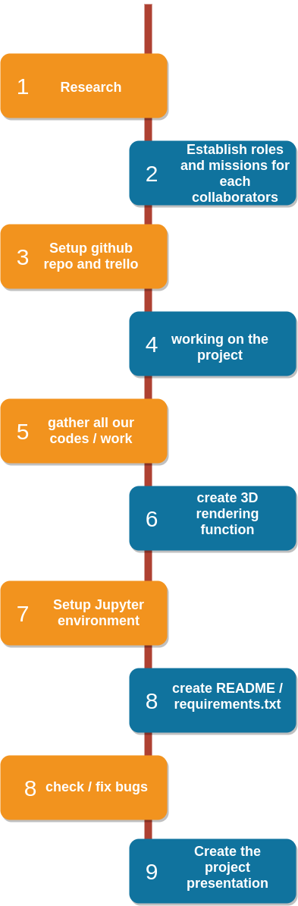

# 3D House Project
This repository provides a Jupyter notebook with the goal to let an end user generate a 3D plot of the house or building on a specified address within the entire Belgium. The main dataset being used to do this is publicly available, and originates from a governmental project called DHMV II to update the Digital Elevation Model.

## Rendering informations

- Repository: `3D_houses`
- Type of Challenge: `Learning & Consolidation`
- Duration: `1 weeks`
- Deadline: `18/06/21 12:30 AM`
- Deployment strategy :
  - Jupyter Notebook
- Team challenge : `Team (3-4)`

## Collaborators and roles

| Collaborators                                         | Role Description                                                                                                                           |
| ----------------------------------------------- | ------------------------------------------------------------------------------------------------------------------------------------- |
|  <br/> Atefeh Hossein| - made a tamtam on her keyboard <br/> - Understand API and how to find L-72 coordinates from an address <br/> - Understand API and how to find L-72 coordinates from an address <br/>        |
|  <br/> Ceren Mörey | - played call of duty in ranked during 1 entire week  <br/> -  Understand API and how to find L-72 coordinates from an address <br/> - asked Hugo to change her name <br/>                                             |
|  </br> Corentin Chanet (Project Manager)                                    | - Optimization for handling large geo & raster files <br/> - Coordination and support to team members <br/> - Clipping rasters with polygons <br/> - Peeled the potatoes <br/>|
|  <br/> Hugo Pradier                                     | - bet 50 eu on the match France-Hungary and lost everything <br/> - slept during the end of day review on Tuesday and woke up thanks to maxime <br/> - Ate pastas during 1 week <br/>                                                       |
## Mission objectives

Consolidate the knowledge in Python, specifically in :

- [X] NumPy
- [X] GeoPandas, shapely (Geo Data)
- [X] rasterio, rioxarray (Raster Data)
- [X] mayavi (3D plotting libraries)

## Learning Objectives

- [X] to be able to search and implement new libraries
- [X] to be able to read and use the [shapefile](https://en.wikipedia.org/wiki/Shapefile) format
- [X] to be able to read and use geoTIFFs
- [X] to be able to render a 3D plot
- [X] to be able to present a final product

## The Mission

> We are _LIDAR PLANES_, active in the Geospatial industry. We would like to use our data to launch a new branch in the insurance business. So, we need you to build a solution with our data to model a house in 3D with only a home address.

### Must-have features

- 3D lookup of houses.

### Nice-to-have features

- Optimize your solution to have the result as fast as possible.
- Features like the living area of the house in m², how many floors, if there is a pool, the vegetation in the neighborhood, etc...
- Better visualization.

### Miscellaneous information

The results we're interested in are DSM (Digital Surface Map) and DTM (Digital Terrain Map).

Which are already computed and available here :

- [DSM](http://www.geopunt.be/download?container=dhm-vlaanderen-ii-dsm-raster-1m&title=Digitaal%20Hoogtemodel%20Vlaanderen%20II,%20DSM,%20raster,%201m)
- [DTM](http://www.geopunt.be/download?container=dhm-vlaanderen-ii-dtm-raster-1m&title=Digitaal%20Hoogtemodel%20Vlaanderen%20II,%20DTM,%20raster,%201m)


## Installation

Install all libraries
```
$ sudo pip install numpy pandas geopandas matplotlib geopy folium natsort fiona shapely rasterio earthpy open3d PyQt5 mayavi jupyterlab rioxarray 
```
To install jupyterlab, if you are using a Unix derivative (FreeBSD, GNU / Linux, OS X), please use this command line:

```
$ export PATH="$HOME/.local/bin:$PATH"
```
If you are interested in the mayavi jupyter notebook support as well, do the following (after ensuring that you have jupyter installed of course):

```
$ jupyter nbextension install --py mayavi --user
$ jupyter nbextension enable --py mayavi --user
```

## Usage
Navigate to the repo root on your terminal then write this command line:
```
$ jupyter notebook
```

## Visuals

## Timeline
 <br/>

Project made at Becode Brussels
