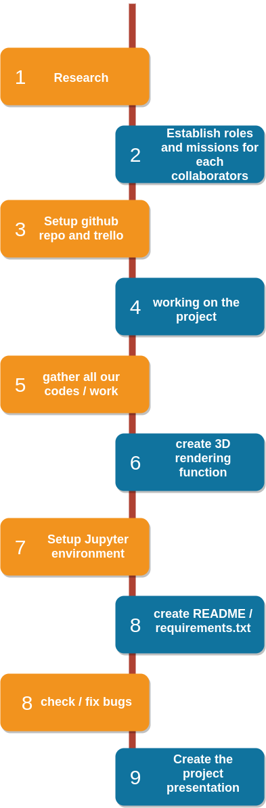

# 3D House Project

- Repository: `3D_houses`
- Type of Challenge: `Learning & Consolidation`
- Duration: `1 weeks`
- Deadline: `18/06/21 12:30 AM`
- Deployment strategy :
  - Jupyter Notebook
- Team challenge : `Team (3-4)`

## Collaborators and Roles

| Collaborators                                         | Roles Description                                                                                                                           |
| ----------------------------------------------- | ------------------------------------------------------------------------------------------------------------------------------------- |
|  <br/> Atefeh Hossein| Small daily talks organized by the learners or coaches on theoretical concepts, interesting related tech, cool findings, etc…         |
|  <br/> Atefeh Hossein | Interactive session given by the trainees on subject they want to teach their colleagues.                                             |
|  </br> Corentin Chanet (Lead Programmer)                                    | A growing project during all the course where the team role-plays as a startup facing growing AI problems (consolidation challenges). |
|  <br/> Hugo Pradier                                     | Study of real life cases of AI, well known hacks and advice from professionals.                                                       |

|                                                                            |                                                                                                                                                                                                                                                 | 
## Mission objectives

Consolidate the knowledge in Python, specifically in :

- [X] NumPy
- [X] Pandas
- [X] Matplotlib

## Learning Objectives

- [X] to be able to search and implement new libraries
- [X] to be able to read and use the [shapefile](https://en.wikipedia.org/wiki/Shapefile) format
- [X] to be able to read and use geoTIFFs
- [X] to be able to render a 3D plot
- [X] to be able to present a final product

## Description


## Installation

```
sudo pip install numpy pandas geopandas matplotlib geopy folium fiona shapely rasterio earthpy open3d PyQt5 mayavi jupyterlab rioxarray
```
for jupyterlab, if you are using a Unix derivative (FreeBSD, GNU / Linux, OS X), you can achieve this by using:

```
export PATH="$HOME/.local/bin:$PATH"
```

## Usage
Navigate to the repo root on your terminal then write this command line:
```
jupyter notebook
```

## Visuals
## Timeline
 <br/>


Project made at Becode Brussels <br/>
