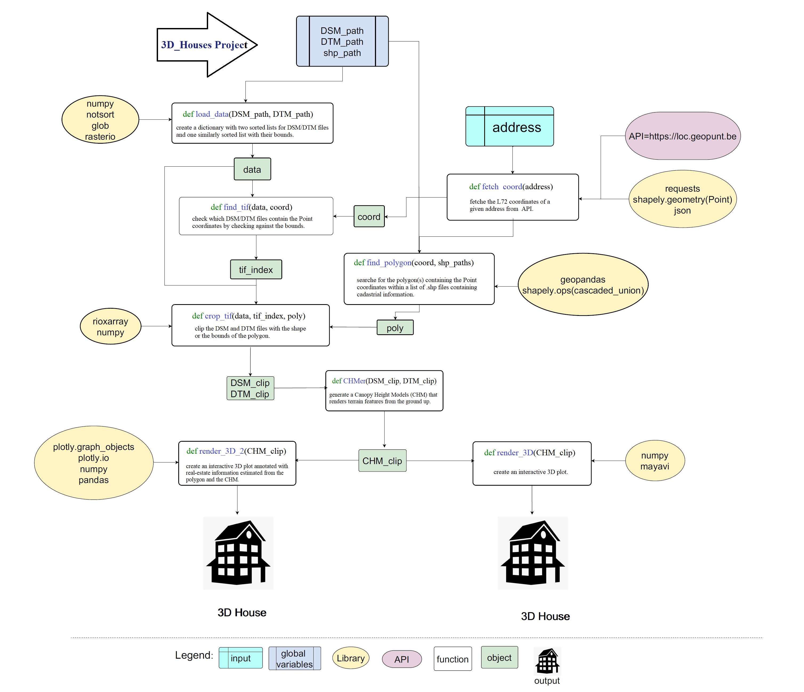
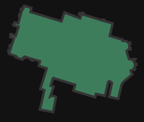
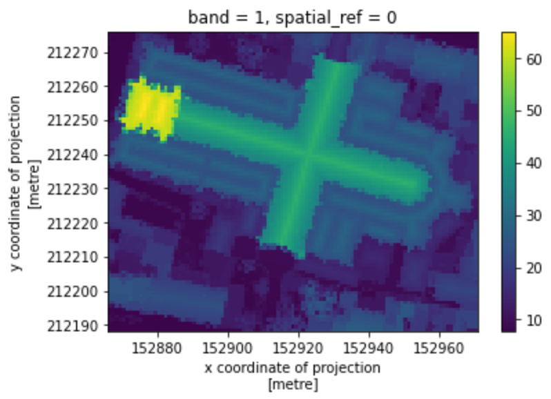
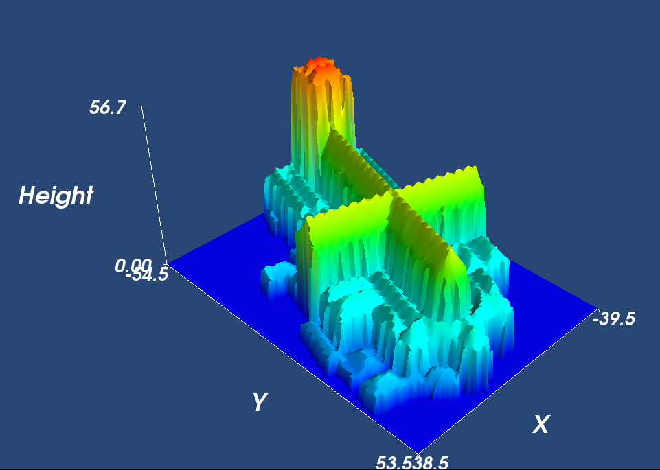

# 3D House Project
This repository provides a Jupyter notebook with the goal to let an end user generate a 3D plot of the house or building on a specified address within the entire Belgium. The main dataset being used to do this is publicly available, and originates from a governmental project called DHMV II.

## Project Guidelines

- Repository: `3D_houses`
- Type of Challenge: `Learning & Consolidation`
- Duration: `1 weeks`
- Deadline: `18/06/21 12:30 AM`
- Deployment strategy :
  - Jupyter Notebook
- Team challenge : `Team (3-4)`

## Technologies / Libraries 

|   [](https://www.python.org/) | [](https://jupyter.org/)  | [](https://numpy.org/)  |  [](https://docs.enthought.com/mayavi/mayavi/) |  [](https://plotly.com/python/) | [](https://www.json.org/json-fr.html)  |   [](https://fr.python-requests.org/en/latest/)  |   [](https://geopandas.org/)  |   [](https://geopandas.org/)
|---|---|---|---|---|---|---|---|---|

- [X]  [Python](https://www.python.org/) : A programming language
- [X]  [Jupyter](https://jupyter.org/) : An open document format based on JSON
- [X]  [Numpy](https://numpy.org/) : The fundamental package for scientific computing with Python
- [X]  [Pandas](https://pandas.pydata.org/) : A fast, powerful, flexible and easy to use open source data analysis and manipulation tool, built on top of the Python programming language.
- [X]  [Mayavi](https://docs.enthought.com/mayavi/mayavi/) : 3D scientific data visualization and plotting in Python
- [X]  [Json](https://www.json.org/json-en.html) : A lightweight data-interchange format
- [X]  [Plotly](https://plotly.com/python/) : An Open Source Graphing Library for python
- [X]  [Geopandas](https://geopandas.org/) : An open source project to make working with geospatial data in python easier
- [X]  [Rasterio](https://rasterio.readthedocs.io/en/latest/) : A tool to Rasterio: access to geospatial raster data
- [X]  [Rioxarray](https://pypi.org/project/rioxarray/) : Rasterio xarray extension
- [X]  [Shapely](https://pypi.org/project/Shapely/) : Manipulation and analysis of geometric objects in the Cartesian plane

## Collaborators and Roles

| Collaborators                                         | Role Description                                                                                                                           |
| ----------------------------------------------- | ------------------------------------------------------------------------------------------------------------------------------------- |
|  <br/> [Atefeh Hossein](https://github.com/atefehhosseinniay)  | - API testing & shapefile processing <br/> - 3D Libraries (Mayavi) <br/> - Research & Documentation <br/>        |
|  <br/> [Ceren Mörey](https://github.com/c-morey) | -  Raster files processing (rasterio) <br/> - API requests to find L-72 coordinates <br/> - Communication strategy <br/>                                             |
|  </br> [Corentin Chanet (Project Manager)](https://github.com/CorentinChanet)                                     | - Code optimization & GUI <br/> - Coordination and support to team members <br/> - 3D Libraries (plotly) <br/>
|  <br/> [Hugo Pradier](https://github.com/pradierh)                                       | - 3D rendering <br/> - github / README.md <br/> - Documentation <br/>  - Jupyter Notebook setup <br/>                                                       |
## Mission Objectives

Consolidate the knowledge in Python, specifically in :

- [X] NumPy
- [X] GeoPandas, shapely (Geo Data)
- [X] rasterio, rioxarray (Raster Data)
- [X] mayavi, plotly (3D plotting libraries)

## Learning Objectives

- [X] to be able to search and implement new libraries
- [X] to be able to read and use the [shapefile](https://en.wikipedia.org/wiki/Shapefile) format
- [X] to be able to read and use geoTIFFs
- [X] to be able to render a 3D plot
- [X] to be able to present a final product

## The Mission

> We are _LIDAR PLANES_, active in the Geospatial industry. We would like to use our data to launch a new branch in the insurance business. So, we need you to build a solution with our data to model a house in 3D with only a home address.

### Must-have features

- 3D lookup of houses.

### Nice-to-have features

- Optimize your solution to have the result as fast as possible.
- Features like the living area of the house in m², how many floors, if there is a pool, the vegetation in the neighborhood, etc...
- Better visualization.

### Miscellaneous information

The results we're interested in are DSM (Digital Surface Map) and DTM (Digital Terrain Map).

Which are already computed and available here :

- [DSM](http://www.geopunt.be/download?container=dhm-vlaanderen-ii-dsm-raster-1m&title=Digitaal%20Hoogtemodel%20Vlaanderen%20II,%20DSM,%20raster,%201m)
- [DTM](http://www.geopunt.be/download?container=dhm-vlaanderen-ii-dtm-raster-1m&title=Digitaal%20Hoogtemodel%20Vlaanderen%20II,%20DTM,%20raster,%201m)


## Installation

### Clone the repository

First, open your terminal then clone the project into your local files

```
$ sudo git clone git@github.com:pradierh/3D_houses.git
```

### Download all the required files

Go into the repository and create a "map" directory and then in it, create a DSM and DTM directories

```
$ cd 3D_houses
$ mkdir map
$ cd map
$ mkdir DSM && mkdir DTM
```

Into DTM directory please download all the [DTM](http://www.geopunt.be/download?container=dhm-vlaanderen-ii-dtm-raster-1m&title=Digitaal%20Hoogtemodel%20Vlaanderen%20II,%20DTM,%20raster,%201m) files

Do the same with the DSM directory and download all the [DSM](http://www.geopunt.be/download?container=dhm-vlaanderen-ii-dsm-raster-1m&title=Digitaal%20Hoogtemodel%20Vlaanderen%20II,%20DSM,%20raster,%201m) files

### Unzip

Unzip all the files in both directories
```
$ unzip \*.zip
```

### Install all libraries
```
$ sudo pip install numpy pandas geopandas natsort fiona shapely rasterio open3d PyQt5 mayavi jupyterlab rioxarray plotly ipywidgets plotly requests
```
To install jupyterlab, if you are using a Unix derivative (FreeBSD, GNU / Linux, OS X), please use this command line:

```
$ export PATH="$HOME/.local/bin:$PATH"
```
If you are interested in the mayavi jupyter notebook support as well, do the following (after ensuring that you have jupyter installed of course):

```
$ jupyter nbextension install --py mayavi --user
$ jupyter nbextension enable --py mayavi --user
```

## Usage
Navigate to the repo root on your terminal then write this command line:
```
$ jupyter notebook
```

## Project Data travels maps

<p align="center">
<br/><br/>
</p>

## Visuals

Visuals exemples of the Sint-Jacob church located in Antwerpen:<br/>
(Lange Nieuwstraat 73, 2000 Antwerpen, Belgique)<br/><br/>

<p align="center">
<br/><br/>
<br/><br/>
<br/><br/>
</p>

<p align="center">
  
</p>

## Timeline
<p align="center">
 <br/>
</p>

#### Project made at BeCode Brussels
